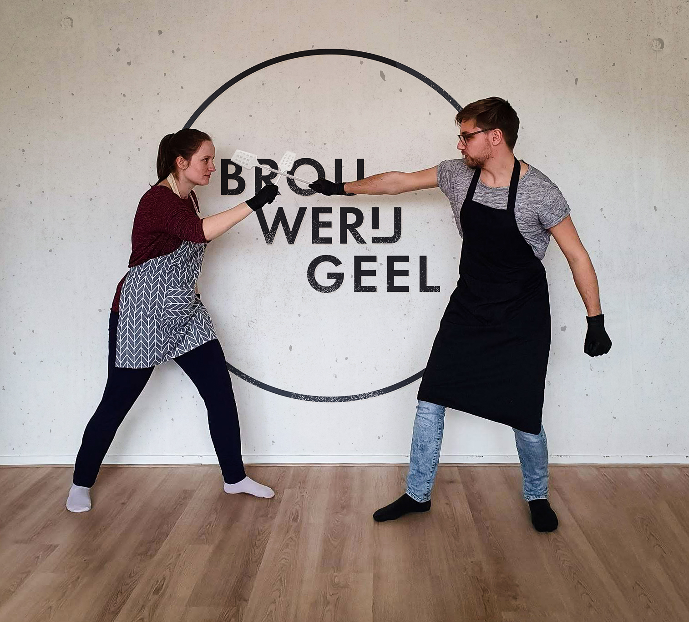

# Brouwerij Geel 🍺

A promotional website for my (hobbyist) endeavors in creating alcohol. This website both lets me easily share stuff (photos, label designs) at parties, but also allows me to document recipes and more.

## Setup

    $ git clone git@github.com:AJGeel/brouwerij-geel.git
    $ open -a MAMP

That's it. Good luck! 🍻

## Tech Stack

This static website is pretty rudimentary: using a simple stack of PHP/CSS/JS. No CSS frameworks, simply using modern vanilla CSS properties (Flex, Grid, Variables). Keeping it simple to keep it fun.

## Dependencies / Externals

Brouwerij Geel's website is built atop of a number of JS frameworks / external dependencies to keep me sane. 

- **Swup.js** — Page transition library: making the website feel smoother through sleek animations between pages. https://github.com/swup/swup
- **Headroom.js** — Hides the header/navbar unless it's needed. https://github.com/swup/swup
- **Disqus** — Embeddable blog which generates a unique thread for each page, saving me the trouble of maintaining spam-prevention measures. Drawback: privacy. https://help.disqus.com/en/articles/1717112-universal-embed-code
